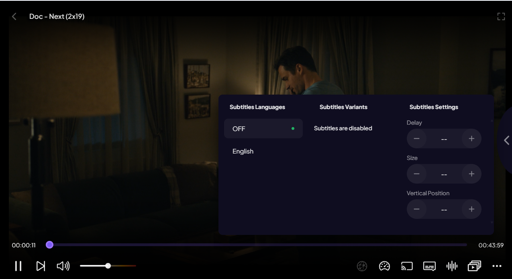
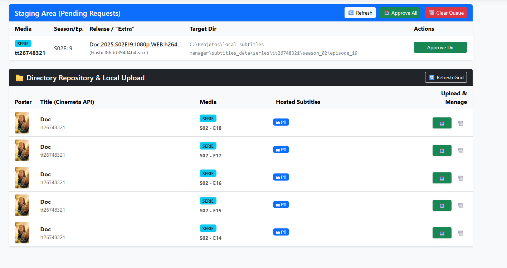
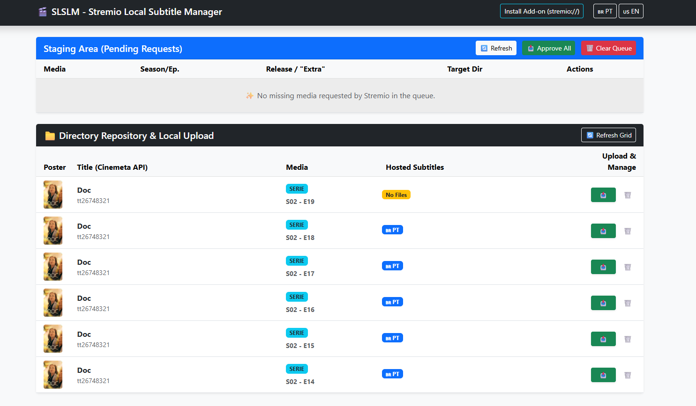
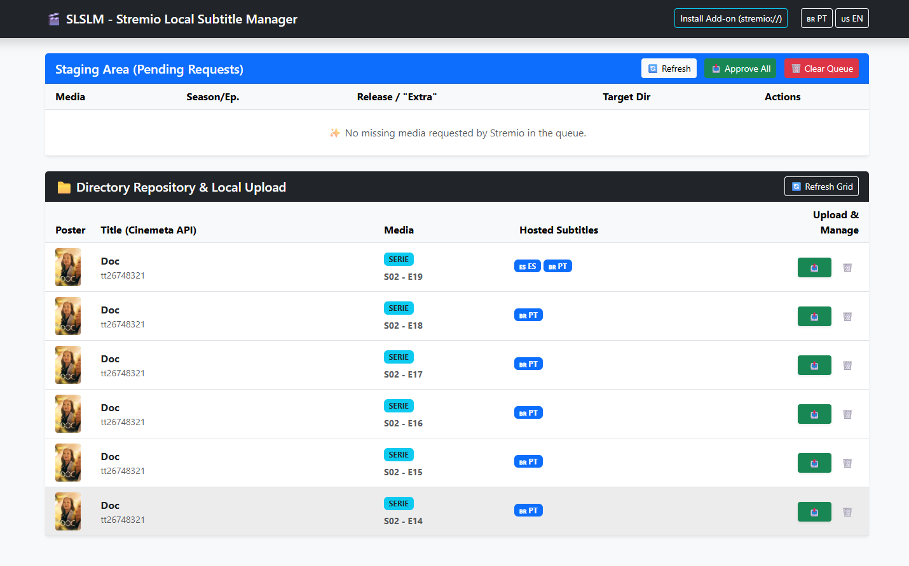
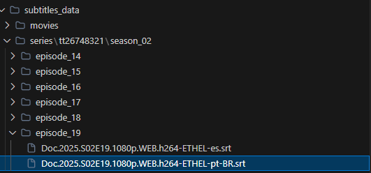
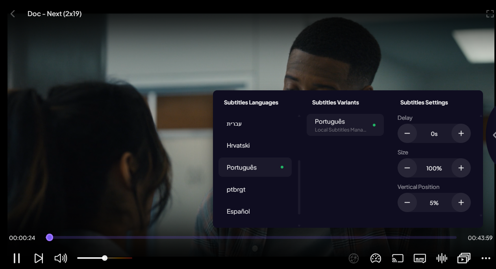

<h1 align="center">🎬 Stremio Local Subtitles Manager</h1>

<p align="center">
  <em>A Python (Flask) framework for passive management and massive submission of local subtitles to your Stremio player, controlled through a robust, multi-language Single Page Application (SPA).</em>
</p>

---

## ⚡ What does SLSM solve?
Have you ever been frustrated by having to download subtitles manually because Stremio couldn't find them on official external sources? Do you hate the bureaucracy of creating all those folders and naming files exactly as required by local Add-ons in your `C:/` or `D:/` drives?

Meet the **Stremio Local Subtitles Manager**! This addon acts as a smart local listener. In the initial request, your Stremio will look for a movie or episode subtitle. If it doesn't have it locally, the App saves that "demand" in memory (Staging Area). You - the Sysadmin of your machine - can then access the Web UI from any browser, and with **just 1 Click** ("Approve All"), the entire empty physical logic and hierarchical folder structures (Movie ID / Seasons / Episodes) are automatically generated and rooted in your hard drive. After that, just upload the files directly using a beautiful UI grid that fetches movie data from the Cinemeta API!

## ✨ Features
- **🎯 Smart Auto-Staging:** Catches organic subtitle errors during your natural Stremio/TV usage and documents these requests for your review and approval.
- **📁 Dynamic Repository Management:** Clean visualization through the "Mega Grid Card", which efficiently filters series into episode-level folders avoiding clutter. The Web Server fetches interactive Titles and Posters using the official public Cinemeta API.
- **🌐 Native Multi-Language Support (i18n):** The entire dashboard translates instantly (Client-Side Vanilla JS) between English (EN) and Brazilian Portuguese (PT-BR) seamlessly, with settings cached! We also have an auto-classification feature for subtitle flags (.eng, .per, .pt).
- **🚀 Simplified Inline Upload:** A frictionless system that allows you to click and push files directly from your Windows Explorer to the target folder with robust backend validation!

## 📸 Process Demo

Take a look at the continuous process flowing seamlessly from the player to our system:

1. **Stremio couldn't find subtitles (No tracks):**
<br>

2. **The App catches the request in the Staging Area:**
<br>

3. **Approved & Structure Generated (1 Click):**
<br>

4. **Inline Upload directly to the new media directory (Multi-Languages):**
<br>

5. **Physical Disk correctly structured by the Backend:**
<br>

6. **Subtitles flawlessly loaded and running on Stremio!**
<br>

---

## 📦 Easy Installation (CLI Daemon)

The project was designed as a pip package module that registers a global executable straight to your Path.

Install it directly from the Git source:
```bash
git clone https://github.com/dennisrosa/stremio-local-subtitles-manager.git
cd stremio-local-subtitles-manager
pip install -e .
```

## 🎮 Starting & Using the CLI (Command Line Engine)
Once the pip installation is complete, you gain permanent access to the `slsm-server` command running isolated from any Powershell, Bash, or CMD inside your environment.

Start it with standard settings, exposing the universal `3001` port:
```bash
slsm-server
```

### Hacker Customization Commands
You are the master of your network. Choose custom inputs if you want to map servers on a NAS, an external SSD drive, or proxy it to any Router Port (e.g., `:8080`):
```bash
slsm-server --port 8080 --storage-path "D:\My_Series\CustomSubs"
```

## 📺 Integrating & Linking your Stremio to the Base
It is incredibly simple! Make sure your Server is Online. Then, access the landing page (usually `http://localhost:3001`) and click on **Install Add-on**.

A popup will guide you to choose between:
- **Local Installation**: Mandatory for Stremio Desktop on the same machine.
- **Remote Installation**: For TV Boxes, Mobile devices, or other computers on the same network.

---

### License
Free Software maintained as a contribution to the OpenSource ecosystem with care. Use and modify it at will! 🚀
